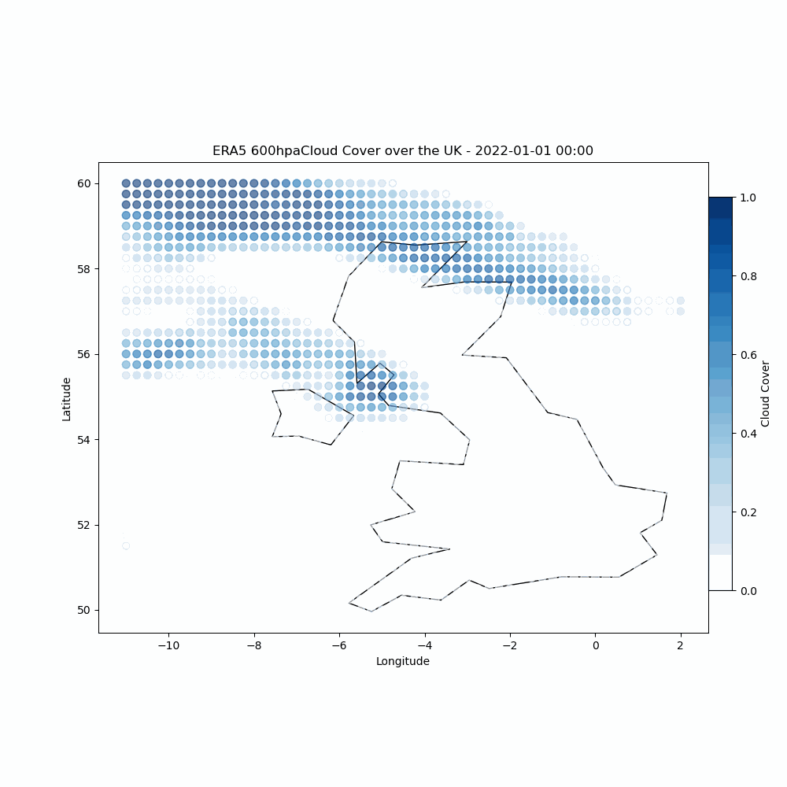

# Python-SimCloud
My recreation of the fractional cloud coverage scheme set out in the SimCloud paper for ISCA. 

The original scheme is set out here: https://gmd.copernicus.org/articles/14/2801/2021/gmd-14-2801-2021-assets.html

## Performance
Python SimCloud currently predicts fractional cloud coverage over the UK wint an mse of 0.17, and globally for Jan-Feb 2022 mse of 0.22

Comparison of performance can be seen in the gifs below, at 600hPa.

### Known Issues:
1. The code could be optimised by removing unnecessary loops, replacing them with vectorised operations. This would also make the code easier to read and maintain.
2. retain_first_non_zero_1d function is an assumption that if the lapse rate is met at multiple levels, then the lowest pressure between 750 and 1013 hpa will be selected as the only location for stratocumulus clouds in theat column.
3. Some values are calculated via external equations not explicitly mentioned in the SimCloud paper, e.g. dew point temperature, inversion height, and lapse rate. these new equations may have introduced assumptions not present in the innitial scheme. 
